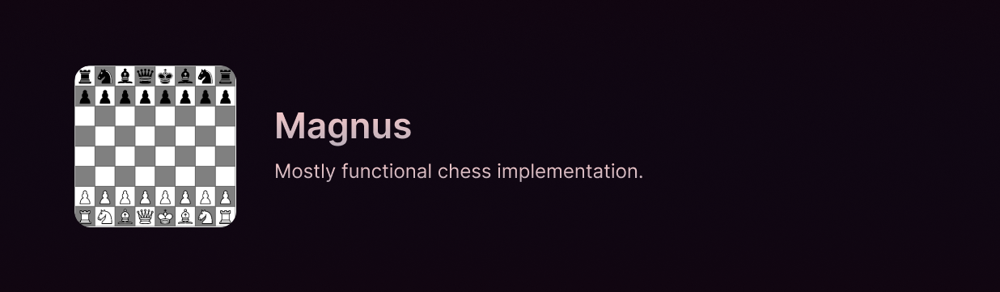

> _Like a fading summer star, rising from the ocean to shine bright~_

## Overview

Magnus is a chess implementation written in Visual Basic .NET. It is a simple chess game that allows you to play by taking turns with another player. The game is designed to be simple and easy to use, with a clean and intuitive user interface. This project is designed for college submission.

The project is already submitted and graded, so development is no longer active. However, you are free to fork the project and make your own changes. Current features status is mostly complete, with one feature that is determining all pieces for checkmate not implemented, only determing check by last piece moved.

## License

This project is licensed under the [MIT License](LICENSE). Please refer to the license for more information.
